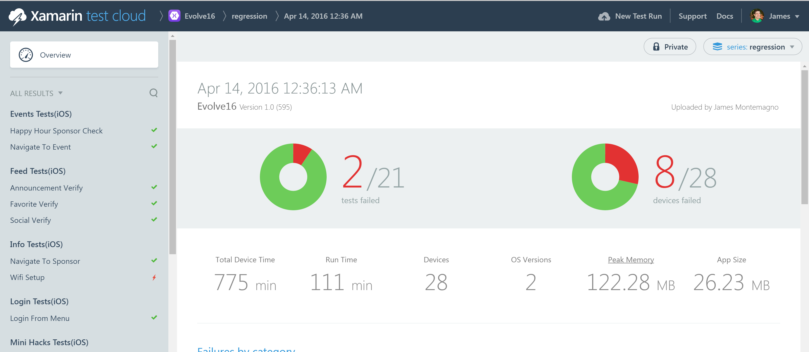
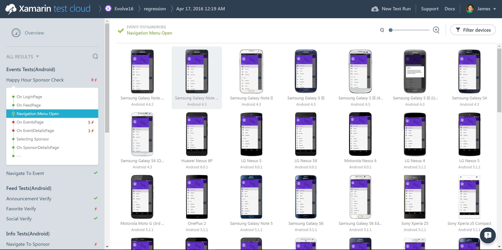
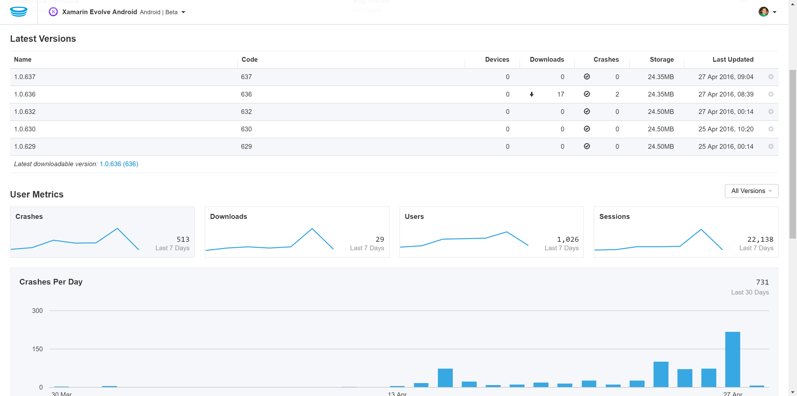

# Xamarin Evolve 2016 Mobile App


## Download from App Store
* [iOS: App Store](https://itunes.apple.com/us/app/xamarin-evolve/id618319027) 
* [Android: Google Play](https://play.google.com/store/apps/details?id=com.xamarin.xamarinevolve)
* [Windows 10: Marketplace](https://www.microsoft.com/en-us/store/apps/xamarin-evolve/9nblggh0ff9k) (Mobile & Desktop)

The Xamarin Evolve 2016 app is full of awesome and includes everything that you would expect from a spectacular conference application, but features tons of deep integration with:

* Azure + Online/Offline Sync
* Barcode Scanning
* Calendar Integration
* Maps & Navigation
* Push Notifications
* Phone Dialer
* Wi-Fi configuration
* URL Navigation (Universal Links + Google App Indexing)
* A bunch of other great things

## Shared code details
This app is around 15,000 lines of code. The iOS version contains 93% shared code, the Android version contains 90% shared code, the UWP has 99% shared code, and our Azure backend contains 23% shared code with the clients!:
        
<table>
  <tr>
    <td>
      
    </td>
    <td>
      
    </td>
    </tr>
    <tr>
    <td>
      
    </td>
    <td>
      
    </td>
  </tr>
</table>

## Test Cloud Integration
With each push of code the Xamarin Evolve app was built with [Visual Studio Team Services](https://www.visualstudio.com/en-us/products/visual-studio-team-services-vs.aspx) and [Bitrise](http://bitrise.io) and deployed to be test on a plethora of apps in Xamarin Test Cloud. You can view results for both [iOS](https://testcloud.xamarin.com/test/evolve16_2857b3a8-e28a-4363-a174-60b076a047f9/) and [Android](https://testcloud.xamarin.com/test/evolve16_b6eac105-15e3-412d-b9a7-539f71c41c99/).





## HockeyApp crash reporting
Not only was the Evolve 2016 app continuously deployed for testing with [HockeyApp](http://hockeyapp.net), but also provided events and crash reporting.




# Getting Started

## Mobile App
Open up src/XamarinEvolve.sln, which contains the iOS, Android, and Windows project. Simply restore your NuGet packages and build the application. It will run out of the box and will work off of a sample backend that we have published. 

## Data Source
Out of the box the Evolve Mobile app uses sample data provided by the XamarinEvolve.DataStore.Mock. This is great for development, but you can also test against the test/development read-only Azure App Server Mobile Apps backend. Simply head to *XamarinEvolve.Client.Portable/ViewModel/ViewModelBase.cs*.

Simply change:

```
public static void Init (bool mock = true)
```

to

```
public static void Init (bool mock = false)
```

# Additional setup

## Push Notifications
All of the code for Azure Notification Hubs has been integrated into the Xamarin Evolve application, you will just need to setup your Azure Notifcation Hub Keys and Google Keys. Please read through the [startup guide](https://azure.microsoft.com/en-us/documentation/articles/notification-hubs-overview/) and then fill in your keys in: **XamarinEvolve.Utils/Helpers/Constants.cs**


## Google Maps API key (Android)
There is a “Debug” key that you can use out of the box, or you can configure your own. For Android, you'll need to obtain a Google Maps API key:
https://developer.xamarin.com/guides/android/platform_features/maps_and_location/maps/obtaining_a_google_maps_api_key/

Insert it in the Android project: `~/Properties/AndroidManifest.xml`:

    <application ...>
      ...
      <meta-data android:name="com.google.android.geo.API_KEY" android:value="GOOGLE_MAPS_API_KEY" />
      ...
    </application>


## Bing Maps API Key (UWP)

In App.xaml.cs in the XamarinEvolve.UWP update Xamarin.FormsMaps.Init(string.Empty); with your API key from https://www.bingmapsportal.com/

## HockeyApp Crash Reporting
Simply head over to http://hockeyapp.net and register a new iOS/Android/UWP application and fill in the HockeyApp API Keys in **XamarinEvolve.Utils/Helpers/Constants.cs** to enable crash reporting.

## Build your own Backend

This repo contains a full backend that you can deploy to your own Azure App Service Mobile App Backend.

# About
The Xamarin Evolve mobile apps were handcrafted by Xamarins spread out all over the world.

**Development:**
* [James Montemagno](http://github.com/jamesmontemagno)
* [Pierce Boggan](http://github.com/pierceboggan)

**Design:**
* [Antonio García Aprea](http://github.com/deskfolio)

**Testing:**
* [Ethan Dennis](https://github.com/erdennis13)

**Many thanks to:**
* [Fabio Cavalcante](https://github.com/fabiocav)
* [Matisse Hack](https://github.com/MatisseHack)
* [Sweetkriti Satpathy](https://github.com/Sweekriti91)
* [Andrew Branch](https://github.com/andrewbranch)
